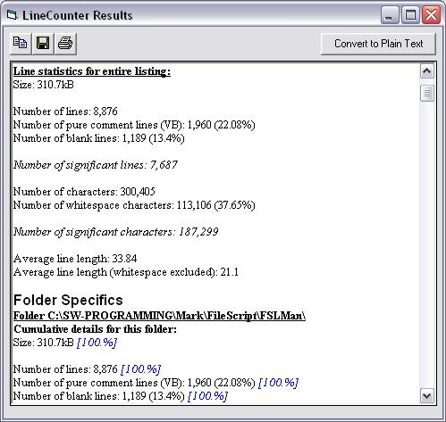



## Simplified VB Line Counter \(Mark B\)

### Description

This program will count the number of lines, characters, etc, of a specified list of files in a given folder (and optionally all of its subfolders). I plan to add more statistical data later, such as a list of the "top ten" files, by number of lines. The line counting method is simple: it counts all lines that contain any non-whitespace characters. It also counts the number of pure comment lines (those that start with a ' and contain no code) and displays that number. There are probably better counting algorithms out there but this project is somewhat tailored to the kind of coding I do. Among other things, this module also demonstrates how to use the Browse For Folder dialog (Windows API--thanks to Dev Ashish) and the FileSystemObject to recursively search for files. Please vote, as I'm just plain curious :P.  --Mark
 
### More Info
 

             |
---                |---
**Submitted On**   |2002-08-05 11:20:00
**By**             |[Mark Biddlecom](https://github.com/Planet-Source-Code/PSCIndex/blob/master/ByAuthor/mark-biddlecom.md)
**Level**          |Intermediate
**User Rating**    |4.3 (13 globes from 3 users)
**Compatibility**  |VB 6\.0
**Category**       |[Complete Applications](https://github.com/Planet-Source-Code/PSCIndex/blob/master/ByCategory/complete-applications__1-27.md)
**World**          |[Visual Basic](https://github.com/Planet-Source-Code/PSCIndex/blob/master/ByWorld/visual-basic.md)
**Archive File**   |[Simplified114620852002\.zip](https://github.com/Planet-Source-Code/mark-biddlecom-simplified-vb-line-counter-mark-b__1-37648/archive/master.zip)

### API Declarations

Two API functions for use in the Browse For Folder dialog. Check modBrowseForFolder.

